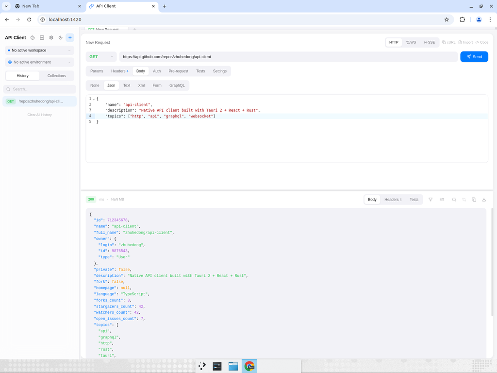
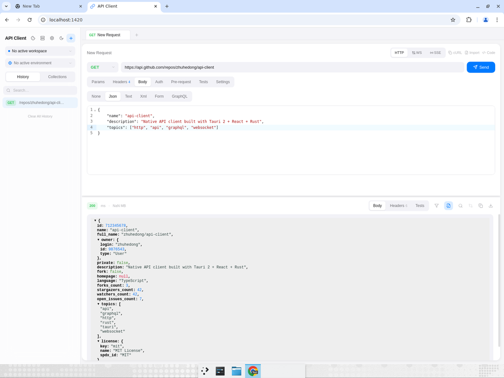
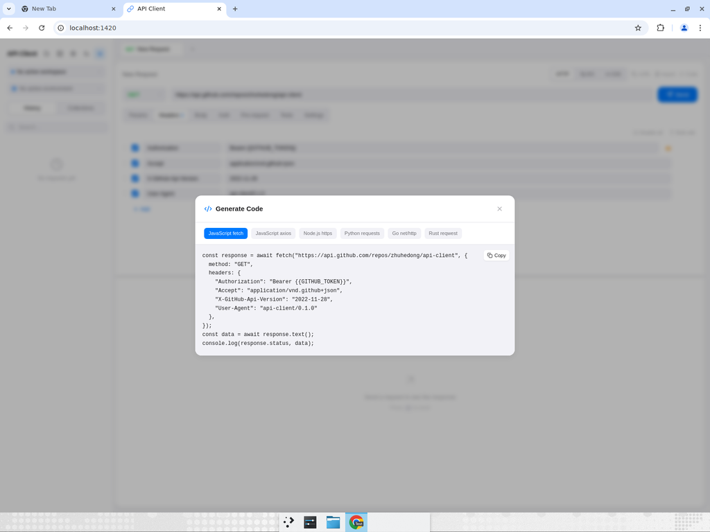
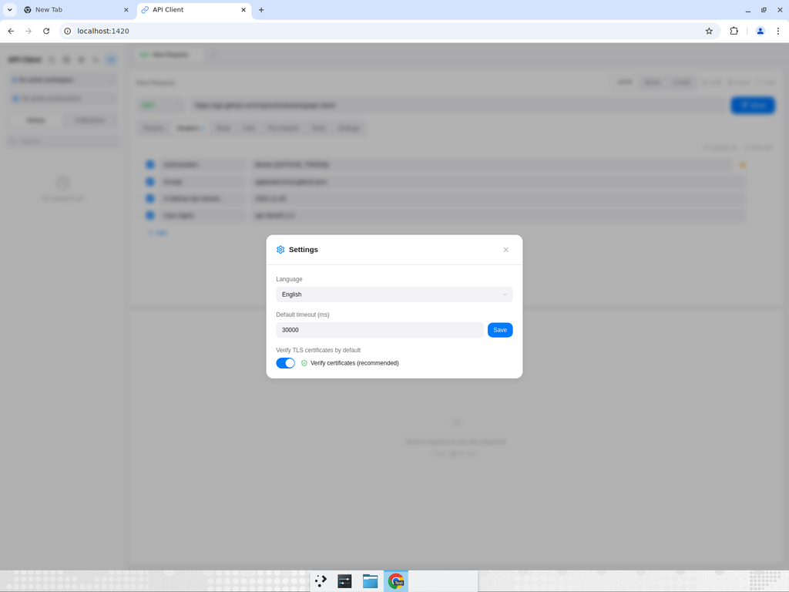
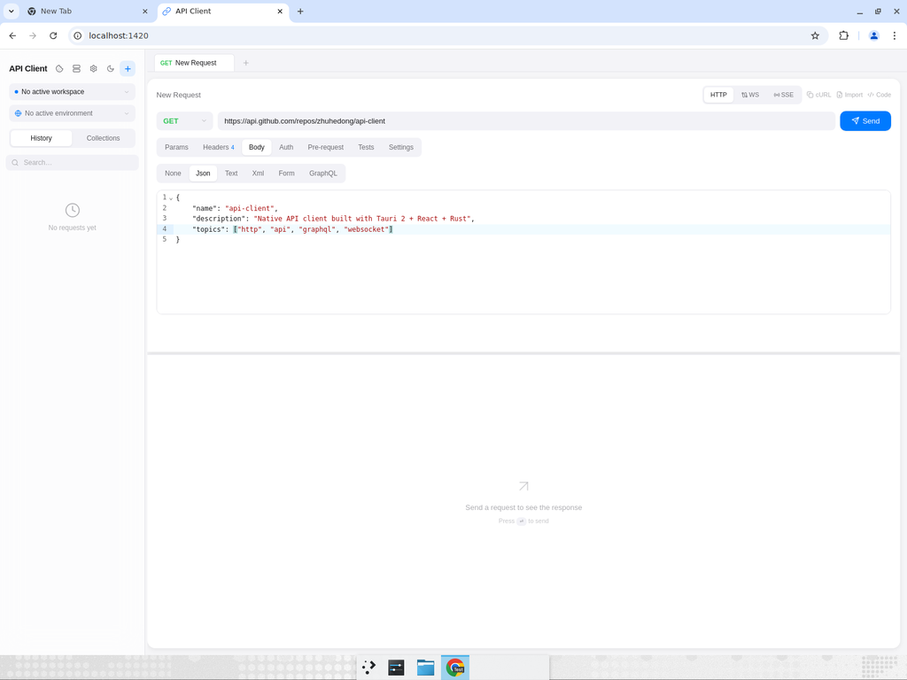
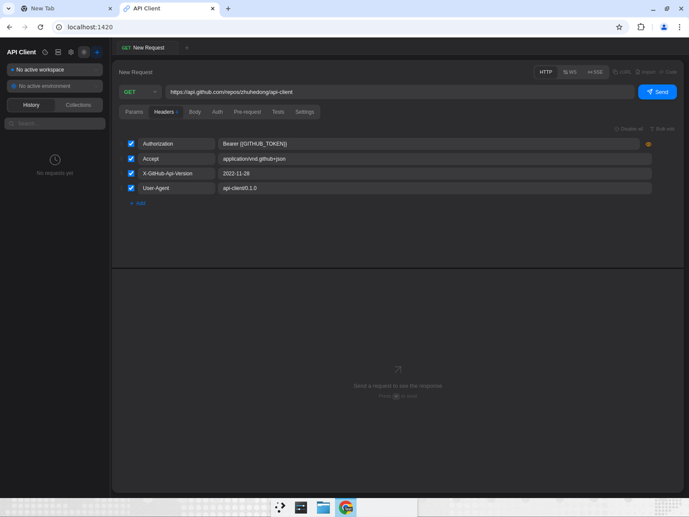
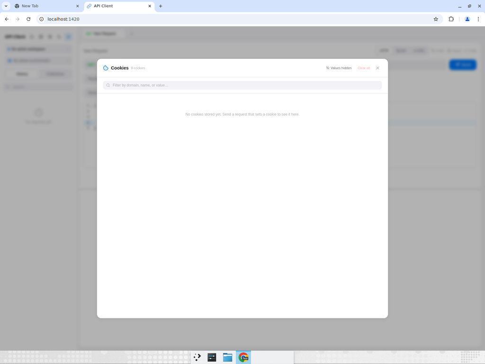
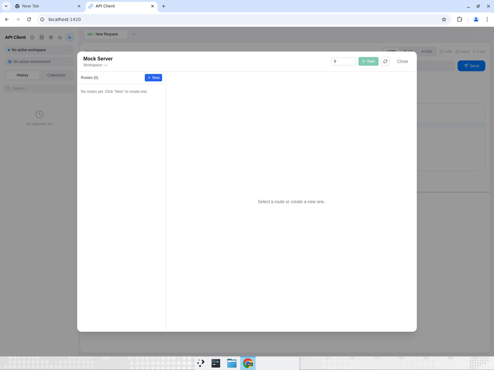
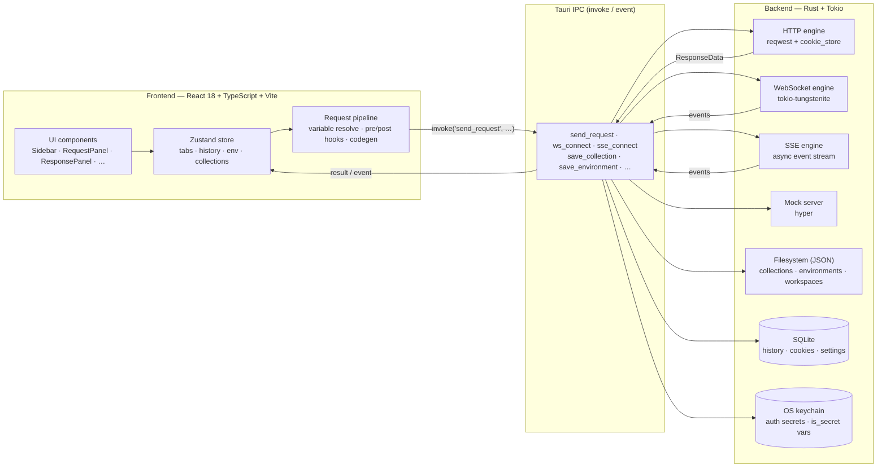
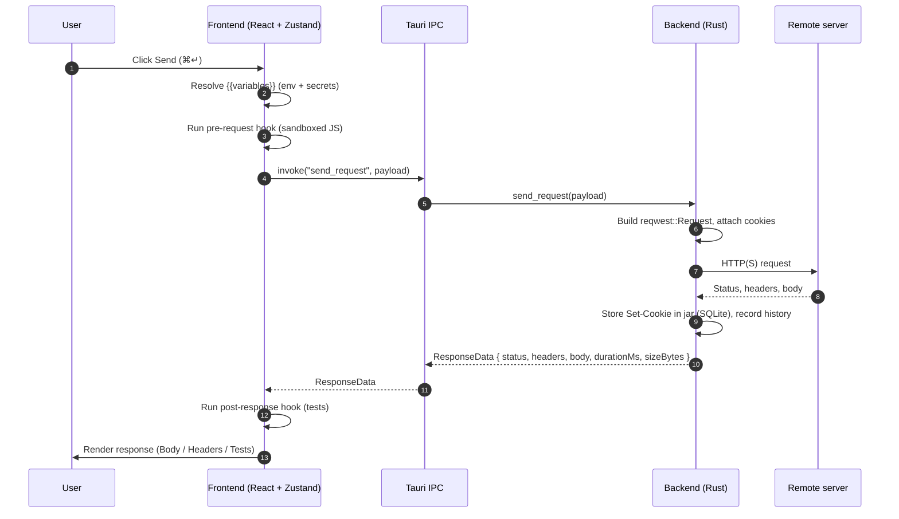

# API Client

<p align="center">
  <a href="./README.md"></a>
  <a href="./README.zh-CN.md"></a>
</p>

<p align="center">
  <a href="./LICENSE"></a>
  
  
  
  
</p>

> A fast, native, Postman‑style API client — built with **Tauri 2 · React 18 · Rust**.

A cross‑platform desktop app (macOS / Linux / Windows) for HTTP, WebSocket, Server‑Sent Events and GraphQL — in a small native binary instead of a half‑gigabyte Electron download. Collections live as plain JSON files (safe to commit/sync), secrets live in the OS keychain, and every request flows through a real Rust HTTP stack with a real cookie jar.

<p align="center">
  
</p>

<p align="center">
  <a href="#about">About</a> ·
  <a href="#features">Features</a> ·
  <a href="#screenshots">Screenshots</a> ·
  <a href="#quick-start">Quick start</a> ·
  <a href="#architecture">Architecture</a> ·
  <a href="#building-from-source">Building</a> ·
  <a href="#data--storage">Data &amp; storage</a> ·
  <a href="#contributing">Contributing</a>
</p>

---

## About

**API Client** is a desktop application for designing, executing, and organizing API requests during development. Think Postman or Insomnia, but smaller, native, and with the request engine written in Rust.

| | |
|---|---|
| **Status** | Early development — `v0.1.0`, actively iterated on |
| **Platforms** | macOS (Apple Silicon + Intel), Linux (x86_64), Windows (x86_64) |
| **Built with** | [Tauri 2](https://v2.tauri.app/), React 18 + TypeScript, Rust (Tokio + reqwest), SQLite, Zustand, TailwindCSS, CodeMirror |
| **Distribution** | Native installer per platform (no bundled Chromium / Node runtime) |
| **Languages** | English · 简体中文 (in‑app + this README) |
| **License** | [MIT](./LICENSE) |
| **Source** | [github.com/zhuhedong/api-client](https://github.com/zhuhedong/api-client) |

It is designed for engineers who want a Postman‑style workflow without the Postman‑sized footprint, and who want their collections to live as plain files they can read, grep, and commit.

## Why this project

Most "lightweight" API clients aren't lightweight at all — they ship a full Chromium for the UI and a JavaScript runtime for the HTTP engine. This project takes a different bet:

- **Native shell** — the frontend renders inside each OS's own WebView (WebKit / WebView2), shipped by Tauri. No bundled Chromium.
- **Real Rust HTTP stack** — every request is built and sent by [`reqwest`](https://docs.rs/reqwest), with a real `cookie_store::CookieStore` wired in, real TLS, real timeouts and real cancellation tokens. The frontend just describes _what_ to send.
- **Files you can read** — collections, environments and workspaces are stored as plain JSON on disk. Safe to grep, diff, back up, or commit. Secrets never touch those files — they go to the OS keychain.

The result is a compact native installer that behaves like a desktop app, not a tab.

---

## Features

### Protocols
- **HTTP** — `GET` · `POST` · `PUT` · `PATCH` · `DELETE` · `HEAD` · `OPTIONS`
- **WebSocket** — connect / send / receive / close, with arbitrary handshake headers (e.g. `Authorization`)
- **Server‑Sent Events** — long‑lived event streams with line‑buffered parsing and retry hints
- **GraphQL** — dedicated body type that auto‑wraps `{ query, variables }`

### Request building
- URL bar with query‑parameter editor and method picker
- Headers and form fields with toggle‑per‑row, drag‑to‑reorder and **bulk‑edit** mode (paste a raw `Key: value` block)
- Body types: `none` · JSON · text · XML · form‑data · GraphQL — with **CodeMirror** syntax highlighting (JSON / XML / HTML / JS)
- form‑data with **file upload** through the native OS file picker
- Auth: Bearer · Basic · API Key (header or query) · OAuth 2.0 helpers
- Per‑request **timeout** override (with a global default in Settings)
- Per‑request **TLS verification** override (default: verify)
- Pre‑request and post‑response **JavaScript hooks** (CodeMirror editor)
- Request cancellation (`Esc`) — backed by a real `CancellationToken` on the Rust side

### Variables & secrets
- Multiple **environments**, switchable from the sidebar
- `{{var}}` interpolation in URL, params, headers, body and auth fields, with live unresolved‑variable warnings
- Variables flagged `is_secret` are stored in the **OS keychain**, not in plain JSON
- Auth secrets (bearer tokens, basic passwords, API keys) are likewise persisted to the keychain when saved to a collection; the on‑disk JSON only contains blanks

### Cookies
- Real cookie jar wired into the HTTP client — `Set-Cookie` from responses is sent on subsequent requests
- Persisted across app restarts in SQLite
- Cookies panel for browsing, filtering, deleting and clearing by domain — with a "reveal values" toggle

### Organization
- Multi‑tab requests (open / close / reorder, `⌘T` / `⌘W`)
- **Workspaces** with their own collections, environments and history
- Collections with nested folders and drag‑and‑drop reorder
- Workspace state (active request, environment, tab layout, panel split) saved across restarts
- **History** view with search by URL or request name

### Import / export
- **cURL** — paste any `curl …` to import, or copy any request as a one‑liner
- **Postman v2.x** — import and export full collections
- **OpenAPI / Swagger** — import a spec and generate a collection
- **Code generation** — `fetch`, `axios`, `node:https`, Python `requests`, Go `net/http`, Rust `reqwest`

### Response viewer
- JSON **pretty‑print** with syntax highlighting and a collapsible **tree view**
- **JSONPath** filter for slicing large payloads
- In‑body **search** with hit highlighting
- Status / timing / size badges, headers tab, save‑to‑file
- **Diff** mode — once a request has been sent twice, the two responses can be diffed side by side

### Mock server
- Spin up a local HTTP **mock server** scoped to a workspace, define routes with custom status / headers / body, and point any client (curl, your app, this client) at it. Useful for offline development and tests.

### UX
- **Dark / light theme** that follows the system
- Keyboard shortcuts: `⌘↵` send · `⌘N` / `⌘T` new tab · `⌘W` close tab · `⌘L` focus URL · `Esc` cancel · `⌘K` search palette
- **i18n** — UI strings are translated for English and 简体中文
- Native menu integration through Tauri

---

## Screenshots

> The screenshots below are captured from the running Vite dev server. They reflect the same layout you get inside the Tauri shell.

| | |
|---|---|
| **Request builder + response viewer**<br/>Headers, JSON body with syntax highlighting, status / timing badges, JSON tree, search, copy, save‑to‑file. <br/><br/> | **Response — tree / headers / raw**<br/>Toggle between the raw JSON, an interactive tree, or the response header table. <br/><br/> |
| **Code generation**<br/>One click to copy the exact request as `fetch`, `axios`, `node:https`, Python `requests`, Go `net/http`, or Rust `reqwest`. <br/><br/> | **Settings**<br/>Language (English / 简体中文), default timeout, default TLS verification — saved per install. <br/><br/> |
| **Body editor — JSON**<br/>CodeMirror with JSON syntax highlighting and line numbers for the request body. <br/><br/> | **Dark mode**<br/>Theme follows the OS by default; toggle manually from the title bar. <br/><br/> |
| **Cookies**<br/>Browse and clear cookies from the shared jar. Values are hidden behind a click‑to‑reveal toggle. <br/><br/> | **Mock server**<br/>Start a local HTTP mock on a free port, define routes, and use the client as both the server and the consumer. <br/><br/> |

---

## Quick start

### Install — prebuilt binary

Grab the installer for your platform from the [Releases](../../releases) page:

| Platform | Format |
|---|---|
| macOS (Apple Silicon + Intel) | `.dmg` (universal) |
| Linux  | `.AppImage` and `.deb` |
| Windows | `.msi` |

Pushing a `v*` tag — or running the **Release** workflow manually — builds all three from [`.github/workflows/release.yml`](.github/workflows/release.yml) and attaches them to a draft GitHub Release.

### First request

1. Launch the app.
2. Paste a URL, e.g. `https://api.github.com/repos/zhuhedong/api-client`.
3. Press `⌘↵` (macOS) or `Ctrl+Enter` (Linux / Windows) to send.
4. Switch the response panel between **Body / Headers / Tests**, and toggle the JSON tree on the right‑hand toolbar.

To save the request to a collection, click the **+** in the sidebar to create one, then drag the open tab onto it.

---

## Architecture

The app is split cleanly into a TypeScript frontend and a Rust backend, communicating over Tauri IPC. The frontend owns _UI state_, the backend owns _IO and persistence_.



### Request lifecycle

What actually happens when you hit **Send**:



### Where things live in the repo

```
api-client/
├─ src/                         # React 18 + TypeScript frontend
│  ├─ App.tsx                   # Layout, keyboard shortcuts, WS event listener
│  ├─ components/               # Sidebar, RequestPanel, ResponsePanel, …
│  │  ├─ RequestPanel.tsx       # URL bar, method, tabs (Params / Headers / Body / Auth / …)
│  │  ├─ ResponsePanel.tsx      # Body / Headers / Tests view + tree / search / diff
│  │  ├─ KeyValueEditor.tsx     # Headers / params / form-data rows + bulk edit
│  │  ├─ CodeEditorImpl.tsx     # CodeMirror wrapper (JSON / XML / JS / HTML)
│  │  ├─ CookiesPanel.tsx       # Shared cookie jar UI
│  │  ├─ MockServerPanel.tsx    # Workspace-scoped mock server UI
│  │  ├─ EnvironmentPanel.tsx   # Env variables + is_secret editor
│  │  └─ …
│  ├─ store/useRequestStore.ts  # Single Zustand store
│  ├─ utils/requestPipeline.ts  # Variable resolve · hooks · invoke('send_request')
│  ├─ utils/curl.ts             # cURL ⇄ RequestItem
│  ├─ utils/postman.ts          # Postman v2.x ⇄ Collection
│  ├─ utils/openapi.ts          # OpenAPI / Swagger import
│  ├─ utils/codegen.ts          # Codegen for 6 targets
│  └─ i18n/locales/{en,zh}.json # UI translations
├─ src-tauri/
│  ├─ src/lib.rs                # HTTP / WebSocket / cookie jar / Tauri command registry
│  ├─ src/commands.rs           # IPC dispatcher for history, settings, storage
│  ├─ src/storage.rs            # Filesystem JSON (collections, environments, workspaces)
│  ├─ src/db.rs                 # SQLite (history, settings, cookies, recent)
│  ├─ src/secrets.rs            # OS keychain (env-scoped + auth-scoped secrets)
│  ├─ src/sse.rs                # Server-Sent Events engine
│  ├─ src/mock_server.rs        # Local mock HTTP server (hyper)
│  ├─ src/oauth2.rs             # OAuth 2.0 helper
│  ├─ Cargo.toml
│  └─ tauri.conf.json
├─ e2e/                         # Playwright end-to-end tests
├─ docs/images/                 # Screenshots used by this README
├─ .github/workflows/
│  ├─ ci.yml                    # Frontend + backend lint / typecheck / test / build
│  └─ release.yml               # Multi-platform Tauri bundles → GitHub Release
└─ README.md
```

---

## Building from source

### Prerequisites

| Tool | Version |
|---|---|
| Node.js | 18+ (CI uses 20) |
| Rust | stable (managed via `rustup`) |
| Tauri system deps | see [Tauri 2 prerequisites](https://v2.tauri.app/start/prerequisites/) |

On Ubuntu / Debian:

```bash
sudo apt-get update
sudo apt-get install -y \
  pkg-config libglib2.0-dev libgtk-3-dev \
  libwebkit2gtk-4.1-dev libayatana-appindicator3-dev \
  librsvg2-dev libsoup-3.0-dev libjavascriptcoregtk-4.1-dev
```

On macOS, install Xcode Command Line Tools. On Windows, install the Microsoft Visual C++ Build Tools and WebView2 (usually present on Windows 10/11).

### Run in dev mode

```bash
npm install
npm run tauri dev
```

The Vite dev server runs at <http://localhost:1420> and Tauri loads it as the desktop frontend. For a web‑only preview without the Rust backend (useful for UI tweaks), run `npm run dev` instead — the screenshots in this README were captured this way.

### Build a release bundle

```bash
npm run tauri build
```

Produces a native installer in `src-tauri/target/release/bundle/`.

### Typecheck, lint, test

```bash
npm run typecheck                  # tsc --noEmit
npm run lint                       # eslint .
npm test                           # vitest run (frontend utils)
npm run build                      # tsc + vite build
(cd src-tauri && cargo check)      # Rust check
(cd src-tauri && cargo test --lib) # Rust unit tests
(cd src-tauri && cargo clippy --no-deps)  # Rust lint (advisory)
npm run test:e2e                   # Playwright end-to-end (optional)
```

All of the above run on every PR via [`.github/workflows/ci.yml`](.github/workflows/ci.yml). Pushing a `v*` tag triggers [`.github/workflows/release.yml`](.github/workflows/release.yml), which builds macOS / Linux / Windows bundles and attaches them to a draft GitHub Release.

---

## Data & storage

The app stores data in three places, by design:

| Data | Location | Format | Safe to back up / sync? |
|---|---|---|---|
| Collections | `$DATA/com.apiclient.dev/collections/*.json` | JSON | **Yes** — no real secrets |
| Environments | `$DATA/com.apiclient.dev/environments/*.json` | JSON | **Yes** — `is_secret` values are blank on disk |
| Workspaces (active request, env, tabs, splits) | `$DATA/com.apiclient.dev/workspaces/*.json` | JSON | Yes |
| History / cookies / settings | `$DATA/com.apiclient.dev/api-client.db` | SQLite | Yes (binary) |
| Auth secrets and `is_secret` variables | OS keychain under service `com.apiclient.dev` | OS‑specific | Per‑device — never written to disk |

`$DATA` resolves to:

- macOS — `~/Library/Application Support`
- Linux — `~/.local/share`
- Windows — `%APPDATA%`

This split is the whole point: collection JSON files are safe to commit and share, while real credentials stay on the device they were entered on.

---

## Contributing

PRs welcome. A few small ground rules:

1. Run `npm run typecheck`, `npm run lint`, `npm test`, and `(cd src-tauri && cargo check && cargo clippy --no-deps)` before pushing. CI runs the same set.
2. Keep changes focused — please don't bundle drive‑by reformatting with feature work.
3. Frontend code follows the existing Zustand store pattern (one `useRequestStore`) and the existing component layout under `src/components/`.
4. Backend code lives in `src-tauri/src/` — new Tauri commands go through `tauri::generate_handler!` in `lib.rs`.
5. UI strings should be added to **both** `src/i18n/locales/en.json` and `src/i18n/locales/zh.json`.

For deeper conventions, see [`CONTRIBUTING.md`](./CONTRIBUTING.md). Notable changes are tracked in [`CHANGELOG.md`](./CHANGELOG.md); the architecture overview lives at [`docs/architecture.md`](./docs/architecture.md); security disclosures go through [`SECURITY.md`](./SECURITY.md).

---

## License

Released under the [MIT License](./LICENSE) — see the `LICENSE` file for the full text.

Copyright (c) 2025 zhuhedong.
