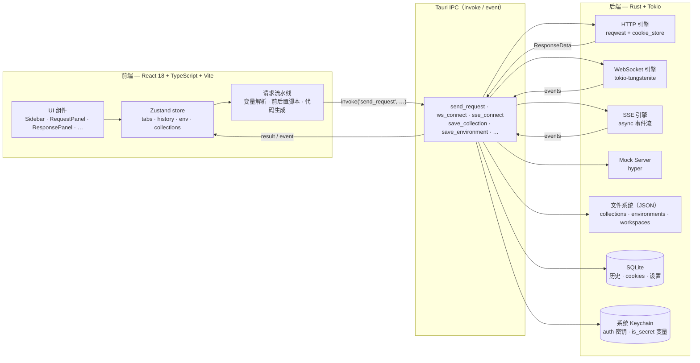
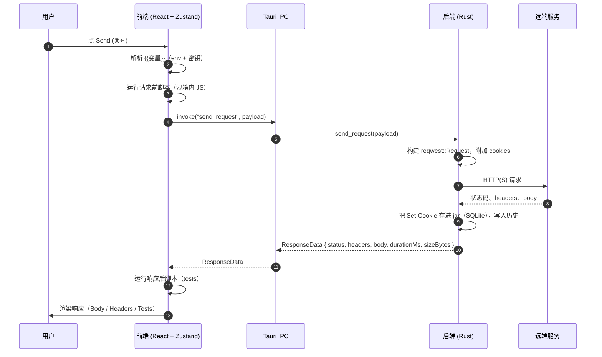

# API Client

<p align="center">
  <a href="./README.md"></a>
  <a href="./README.zh-CN.md"></a>
</p>

<p align="center">
  <a href="./LICENSE"></a>
  
  
  
  
</p>

> 一款快速、原生、Postman 风格的 API 客户端 —— 使用 **Tauri 2 · React 18 · Rust** 构建。

跨平台桌面应用（macOS / Linux / Windows），支持 HTTP、WebSocket、Server-Sent Events 与 GraphQL —— 是一个小巧的原生程序，而不是动辄数百兆的 Electron 包。Collection 以纯 JSON 文件存放（可以放心提交 / 同步），密钥写入系统 Keychain，每一次请求都由真正的 Rust HTTP 栈和真正的 cookie jar 发出。

<p align="center">
  
</p>

<p align="center">
  <a href="#关于">关于</a> ·
  <a href="#功能">功能</a> ·
  <a href="#截图">截图</a> ·
  <a href="#快速开始">快速开始</a> ·
  <a href="#架构">架构</a> ·
  <a href="#从源码构建">从源码构建</a> ·
  <a href="#数据与存储">数据与存储</a> ·
  <a href="#贡献">贡献</a>
</p>

---

## 关于

**API Client** 是一款用于开发阶段设计、调用和组织 API 请求的桌面应用。可以把它理解为 Postman / Insomnia，但更小、更原生，请求引擎用 Rust 写就。

| | |
|---|---|
| **状态** | 早期开发中 —— `v0.1.0`，仍在持续迭代 |
| **平台** | macOS（Apple Silicon + Intel）、Linux（x86_64）、Windows（x86_64） |
| **技术栈** | [Tauri 2](https://v2.tauri.app/)、React 18 + TypeScript、Rust（Tokio + reqwest）、SQLite、Zustand、TailwindCSS、CodeMirror |
| **分发方式** | 每个平台对应一个原生安装包（不打包 Chromium / Node 运行时） |
| **多语言** | English · 简体中文（应用内 + 本 README） |
| **协议** | [MIT](./LICENSE) |
| **源码** | [github.com/zhuhedong/api-client](https://github.com/zhuhedong/api-client) |

它面向希望保留 Postman 工作流、但不愿承受 Postman 体积的工程师，也面向希望把 collection 直接作为可读、可 grep、可提交的纯文件管理的人。

## 为什么做这个项目

大多数号称"轻量"的 API 客户端其实并不轻 —— 界面打包了整套 Chromium，HTTP 引擎跑在 JavaScript 运行时上。本项目走的是另一条路：

- **原生外壳** —— 前端运行在各操作系统自带的 WebView（WebKit / WebView2）里，由 Tauri 提供。**不**打包 Chromium。
- **真正的 Rust HTTP 栈** —— 每一次请求都由 [`reqwest`](https://docs.rs/reqwest) 构建并发送，配合真实的 `cookie_store::CookieStore`、真实的 TLS、真实的超时与取消令牌。前端只负责描述"要发什么"。
- **可读的文件** —— Collection、环境变量、Workspace 都以纯 JSON 形式存盘，方便 grep、diff、备份甚至提交到 Git。真正的密钥不会落进这些文件 —— 它们走系统 Keychain。

结果就是：一个体积小、启动后表现像桌面应用而不是浏览器标签页的程序。

---

## 功能

### 协议
- **HTTP** —— `GET` · `POST` · `PUT` · `PATCH` · `DELETE` · `HEAD` · `OPTIONS`
- **WebSocket** —— 连接 / 发送 / 接收 / 关闭，支持任意握手 header（例如 `Authorization`）
- **Server-Sent Events** —— 长连接事件流，按行解析并尊重 `retry:` 提示
- **GraphQL** —— 专用 body 类型，自动包成 `{ query, variables }`

### 请求构建
- URL 输入框搭配 query 参数编辑器与 method 选择器
- Headers 与表单字段支持逐行启停、拖拽排序，并提供 **批量编辑** 模式（粘贴原始 `Key: value` 文本块）
- Body 类型：`none` · JSON · text · XML · form-data · GraphQL —— 全部使用 **CodeMirror** 提供语法高亮（JSON / XML / HTML / JS）
- form-data 通过原生系统文件选择器支持**文件上传**
- 鉴权：Bearer · Basic · API Key（header 或 query）· OAuth 2.0 辅助流程
- 单个请求可覆盖 **超时**（同时在 Settings 里有全局默认值）
- 单个请求可覆盖 **TLS 校验**（默认开启校验）
- 请求前 / 响应后的 **JavaScript 钩子**（CodeMirror 编辑器）
- 请求取消（`Esc`）—— 由 Rust 侧真正的 `CancellationToken` 支持

### 变量与密钥
- 多套 **环境变量**，可在侧边栏切换
- URL、参数、header、body、auth 字段中都支持 `{{var}}` 插值，未解析变量会实时给出提示
- 标记为 `is_secret` 的变量保存到 **系统 Keychain**，不会写入磁盘 JSON
- Auth 中的敏感字段（Bearer token、Basic 密码、API Key）保存到 collection 时同样会落到 Keychain；磁盘上的 JSON 只保留空壳

### Cookies
- 真实的 cookie jar 已挂载到 HTTP 客户端 —— 响应里的 `Set-Cookie` 会自动用于后续请求
- 跨进程重启持久化（存储在 SQLite 中）
- Cookies 面板支持浏览、按域名过滤 / 删除 / 清空，并提供"显示值"开关

### 组织管理
- 多标签页式请求（开 / 关 / 重排，快捷键 `⌘T` / `⌘W`）
- **Workspace** 各自拥有独立的 collection、环境、历史记录
- Collection 支持嵌套目录与拖拽排序
- Workspace 状态（当前请求、当前环境、标签布局、分栏比例）跨重启保存
- **历史记录** 视图支持按 URL 或请求名搜索

### 导入 / 导出
- **cURL** —— 粘贴任意 `curl …` 即可导入，也可把当前请求一键复制为单行 cURL
- **Postman v2.x** —— 完整导入 / 导出 collection
- **OpenAPI / Swagger** —— 导入 spec 并自动生成 collection
- **代码生成** —— `fetch`、`axios`、`node:https`、Python `requests`、Go `net/http`、Rust `reqwest`

### 响应查看器
- JSON **格式化** + 语法高亮，并提供可折叠的 **树视图**
- **JSONPath** 过滤，方便切大响应
- 响应体内 **搜索** 并高亮命中
- 状态码 / 耗时 / 大小角标，独立的 Headers tab，支持保存到文件
- **Diff** 模式 —— 同一请求两次发送后，可并排对比两次响应

### Mock Server
- 在 workspace 内启动本地 HTTP **Mock Server**，自定义路由 / 状态码 / header / body，并把任意客户端（curl、你的业务程序、本客户端本身）指向它。适合离线开发和写测试时使用。

### 体验
- **暗 / 亮主题** 跟随系统
- 快捷键：`⌘↵` 发送 · `⌘N` / `⌘T` 新标签 · `⌘W` 关闭标签 · `⌘L` 聚焦 URL · `Esc` 取消 · `⌘K` 搜索面板
- **国际化** —— 内置 English 与 简体中文 两套界面文案
- 通过 Tauri 集成原生菜单

---

## 截图

> 下面的截图来自正在运行的 Vite 开发服务器，界面布局与 Tauri shell 内完全一致。

| | |
|---|---|
| **请求构建器 + 响应查看器**<br/>Headers、带语法高亮的 JSON body、状态 / 耗时角标、JSON 树、搜索、复制、保存到文件。<br/><br/> | **响应 — 树 / Headers / 原文**<br/>在原始 JSON、可交互树视图与响应头表格之间切换。<br/><br/> |
| **代码生成**<br/>一键把当前请求复制为 `fetch`、`axios`、`node:https`、Python `requests`、Go `net/http` 或 Rust `reqwest` 代码。<br/><br/> | **设置**<br/>语言（English / 简体中文）、默认超时、默认 TLS 校验 —— 按本机持久化。<br/><br/> |
| **Body 编辑器 — JSON**<br/>CodeMirror 提供 JSON 语法高亮与行号。<br/><br/> | **暗黑模式**<br/>默认跟随系统主题，也可在标题栏手动切换。<br/><br/> |
| **Cookies**<br/>浏览和清理共享 cookie jar，cookie 值默认隐藏，需点击切换才显示。<br/><br/> | **Mock Server**<br/>本地启动一个空闲端口上的 HTTP mock，定义路由后即可同时作为服务端与客户端使用。<br/><br/> |

---

## 快速开始

### 安装 —— 直接使用预构建二进制

在 [Releases](../../releases) 页面下载对应平台的安装包：

| 平台 | 格式 |
|---|---|
| macOS（Apple Silicon + Intel） | `.dmg`（universal） |
| Linux  | `.AppImage` 和 `.deb` |
| Windows | `.msi` |

只要打上 `v*` 标签 —— 或者手动触发 **Release** workflow —— [`.github/workflows/release.yml`](.github/workflows/release.yml) 就会同时构建三个平台的安装包，并附加到一个 draft GitHub Release 上。

### 发出第一个请求

1. 启动应用。
2. 粘贴一个 URL，例如 `https://api.github.com/repos/zhuhedong/api-client`。
3. macOS 按 `⌘↵`，Linux / Windows 按 `Ctrl+Enter` 发送。
4. 在响应面板中切换 **Body / Headers / Tests**，并通过右侧工具栏开关 JSON 树视图。

要把请求保存到 collection，点击侧边栏的 **+** 新建一个 collection，再把当前标签页拖拽到它上面。

---

## 架构

整个应用清晰地拆成 TypeScript 前端与 Rust 后端，二者通过 Tauri IPC 通信。前端拥有 *UI 状态*，后端拥有 *IO 与持久化*。



### 请求生命周期

点 **Send** 时实际发生了什么：



### 仓库结构

```
api-client/
├─ src/                         # React 18 + TypeScript 前端
│  ├─ App.tsx                   # 布局、快捷键、WS 事件监听
│  ├─ components/               # Sidebar、RequestPanel、ResponsePanel 等
│  │  ├─ RequestPanel.tsx       # URL 栏、method、tabs（Params / Headers / Body / Auth / …）
│  │  ├─ ResponsePanel.tsx      # Body / Headers / Tests 视图 + 树 / 搜索 / diff
│  │  ├─ KeyValueEditor.tsx     # Headers / params / form-data 行 + 批量编辑
│  │  ├─ CodeEditorImpl.tsx     # CodeMirror 封装（JSON / XML / JS / HTML）
│  │  ├─ CookiesPanel.tsx       # 共享 cookie jar UI
│  │  ├─ MockServerPanel.tsx    # Workspace 范围的 Mock Server UI
│  │  ├─ EnvironmentPanel.tsx   # 环境变量 + is_secret 编辑
│  │  └─ …
│  ├─ store/useRequestStore.ts  # 单一 Zustand store
│  ├─ utils/requestPipeline.ts  # 变量解析 · 钩子 · invoke('send_request')
│  ├─ utils/curl.ts             # cURL ⇄ RequestItem
│  ├─ utils/postman.ts          # Postman v2.x ⇄ Collection
│  ├─ utils/openapi.ts          # OpenAPI / Swagger 导入
│  ├─ utils/codegen.ts          # 六种目标的代码生成
│  └─ i18n/locales/{en,zh}.json # UI 翻译
├─ src-tauri/
│  ├─ src/lib.rs                # HTTP / WebSocket / cookie jar / Tauri 命令注册
│  ├─ src/commands.rs           # 历史、设置、存储的 IPC 分发
│  ├─ src/storage.rs            # 文件系统 JSON（collections / environments / workspaces）
│  ├─ src/db.rs                 # SQLite（history、settings、cookies、recent）
│  ├─ src/secrets.rs            # 系统 Keychain（按 env 与按 auth 维度）
│  ├─ src/sse.rs                # Server-Sent Events 引擎
│  ├─ src/mock_server.rs        # 本地 mock HTTP 服务（hyper）
│  ├─ src/oauth2.rs             # OAuth 2.0 辅助
│  ├─ Cargo.toml
│  └─ tauri.conf.json
├─ e2e/                         # Playwright 端到端测试
├─ docs/images/                 # 本 README 用到的截图
├─ .github/workflows/
│  ├─ ci.yml                    # 前端 + 后端 lint / typecheck / test / build
│  └─ release.yml               # 多平台 Tauri 打包 → GitHub Release
└─ README.md
```

---

## 从源码构建

### 前置依赖

| 工具 | 版本 |
|---|---|
| Node.js | 18+（CI 使用 20） |
| Rust | stable（建议用 `rustup` 管理） |
| Tauri 系统依赖 | 见 [Tauri 2 prerequisites](https://v2.tauri.app/start/prerequisites/) |

Ubuntu / Debian：

```bash
sudo apt-get update
sudo apt-get install -y \
  pkg-config libglib2.0-dev libgtk-3-dev \
  libwebkit2gtk-4.1-dev libayatana-appindicator3-dev \
  librsvg2-dev libsoup-3.0-dev libjavascriptcoregtk-4.1-dev
```

macOS 上请安装 Xcode Command Line Tools；Windows 上安装 Microsoft Visual C++ Build Tools 与 WebView2（Win10/11 通常已自带）。

### 开发模式运行

```bash
npm install
npm run tauri dev
```

Vite 开发服务器跑在 <http://localhost:1420>，Tauri 会把它作为桌面前端加载。如果只想看 UI 而不启动 Rust 后端，跑 `npm run dev` 即可 —— 本 README 中的截图就是这么拍的。

### 打 release 包

```bash
npm run tauri build
```

产物在 `src-tauri/target/release/bundle/`。

### 类型检查、Lint、测试

```bash
npm run typecheck                  # tsc --noEmit
npm run lint                       # eslint .
npm test                           # vitest run（前端 utils）
npm run build                      # tsc + vite build
(cd src-tauri && cargo check)      # Rust 编译检查
(cd src-tauri && cargo test --lib) # Rust 单元测试
(cd src-tauri && cargo clippy --no-deps)  # Rust lint（仅参考）
npm run test:e2e                   # Playwright 端到端（可选）
```

以上所有命令在 PR 提交时都会通过 [`.github/workflows/ci.yml`](.github/workflows/ci.yml) 在 CI 上跑一遍。推送 `v*` tag 会触发 [`.github/workflows/release.yml`](.github/workflows/release.yml)，自动构建 macOS / Linux / Windows 三平台安装包并挂到 draft GitHub Release。

---

## 数据与存储

应用按下面这种方式把数据分三处存放：

| 数据 | 位置 | 格式 | 是否适合备份 / 同步？ |
|---|---|---|---|
| Collections | `$DATA/com.apiclient.dev/collections/*.json` | JSON | **适合** —— 不含真实密钥 |
| Environments | `$DATA/com.apiclient.dev/environments/*.json` | JSON | **适合** —— `is_secret` 值在盘上是空的 |
| Workspaces（活动请求、env、tabs、splits） | `$DATA/com.apiclient.dev/workspaces/*.json` | JSON | 适合 |
| History / cookies / settings | `$DATA/com.apiclient.dev/api-client.db` | SQLite | 适合（二进制） |
| Auth 密钥与 `is_secret` 变量 | 系统 Keychain，service 为 `com.apiclient.dev` | 操作系统决定 | 仅限本机 —— 永远不会落盘到上面的文件里 |

`$DATA` 在各平台分别是：

- macOS —— `~/Library/Application Support`
- Linux —— `~/.local/share`
- Windows —— `%APPDATA%`

这种切分正是本项目的核心理念：collection JSON 文件可放心提交、分享，而真正的凭证只留在它最初被输入的那台机器上。

---

## 贡献

欢迎 PR，几条小约定：

1. 提交前在本地跑 `npm run typecheck`、`npm run lint`、`npm test`，以及 `(cd src-tauri && cargo check && cargo clippy --no-deps)`。CI 跑的是同一套。
2. 改动尽量聚焦，不要把顺手的大段格式化一起带进来。
3. 前端遵循现有的 Zustand 单 store 模式（`useRequestStore`）和 `src/components/` 下的组件布局。
4. 后端在 `src-tauri/src/` —— 新的 Tauri 命令通过 `lib.rs` 里的 `tauri::generate_handler!` 注册。
5. 任何新的 UI 文案要 **同时** 加进 `src/i18n/locales/en.json` 和 `src/i18n/locales/zh.json`。

---

## 协议

本项目以 [MIT License](./LICENSE) 发布 —— 完整条文见仓库根目录的 `LICENSE` 文件。

Copyright (c) 2025 zhuhedong.
